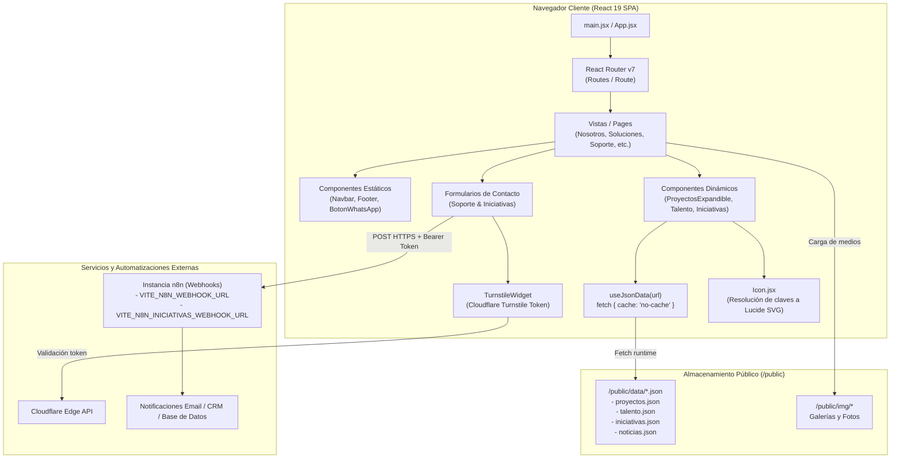

# CUSTOM-VAR — Arquitectura y Documentación Técnica Frontend

Plataforma web SPA (*Single Page Application*) desarrollada para **CUSTOM VAR**, orientada a la gestión y visualización de proyectos, servicios y procesos de ingeniería HVAC (climatización, ventilación mecánica y refrigeración comercial/industrial).

El proyecto está construido sobre el ecosistema **React 19** impulsado por el motor de empaquetado y HMR de **Vite 8**, implementando una arquitectura de contenido desacoplado en runtime (JSON dinámico sin necesidad de recompilación), iconografía vectorial nativa y pipelines automatizados de captura de formularios conectados a **n8n** con verificación anti-bot vía **Cloudflare Turnstile**.

---

## Índice

- [Stack Tecnológico](#stack-tecnológico)
- [Arquitectura del Sistema](#arquitectura-del-sistema)
- [Estructura del Proyecto](#estructura-del-proyecto)
- [Patrones y Decisiones Técnicas](#patrones-y-decisiones-técnicas)
  - [1. Hidratación de Datos Desacoplada (`useJsonData`)](#1-hidratación-de-datos-desacoplada-usejsondata)
  - [2. Sistema de Iconografía Vectorial (`Icon.jsx` + Lucide)](#2-sistema-de-iconografía-vectorial-iconjsx--lucide)
  - [3. Pipeline de Formularios, Seguridad y Automatización (n8n + Turnstile)](#3-pipeline-de-formularios-seguridad-y-automatización-n8n--turnstile)
  - [4. Enrutamiento y Comportamiento SPA](#4-enrutamiento-y-comportamiento-spa)
- [Variables de Entorno](#variables-de-entorno)
- [Instalación y Configuración Local](#instalación-y-configuración-local)
- [Scripts Disponibles](#scripts-disponibles)
- [Despliegue e Infraestructura](#despliegue-e-infraestructura)
- [Auditoría y Convenciones de Código](#auditoría-y-convenciones-de-código)

---

## Stack Tecnológico

| Capa / Módulo | Tecnología | Versión | Rol Técnico / Justificación |
|---|---|---|---|
| **Core UI** | [React](https://react.dev/) | `^19.2.6` | Librería base para la interfaz reactiva basada en componentes funcionales y hooks. |
| **DOM Renderer** | [React DOM](https://react.dev/) | `^19.2.6` | Motor de reconciliación y renderizado en el árbol DOM del navegador. |
| **Bundler & DevServer** | [Vite](https://vite.dev/) | `^8.0.12` | Empaquetador ESM ultrarrápido con soporte nativo para Rollup y Hot Module Replacement (HMR). |
| **Enrutamiento** | [React Router DOM](https://reactrouter.com/) | `^7.17.0` | Enrutamiento declarativo del lado del cliente (Client-Side Routing) con HTML5 History API. |
| **Iconografía** | [Lucide React](https://lucide.dev/) | `^1.51.0` | Conjunto de iconos SVG modulares renderizados como componentes JSX puros (elimina fonts ligature). |
| **Sliders / Carousels** | [@splidejs/react-splide](https://splidejs.com/) | `^0.7.12` | Carruseles táctiles accesibles con soporte swipe y transiciones de alto rendimiento por GPU. |
| **Seguridad Antibot** | [Cloudflare Turnstile](https://www.cloudflare.com/products/turnstile/) | *CDN API* | Validación CAPTCHA no intrusiva para mitigación de bots en envíos de formularios. |
| **Linter** | [ESLint](https://eslint.org/) | `^10.3.0` | Análisis estático de código enfocado en reglas de hooks y buenas prácticas de React. |
| **Hosting & CDN** | [Vercel](https://vercel.com/) | — | Infraestructura de edge hosting con reescritura de rutas para SPAs vía `vercel.json`. |

---

## Arquitectura del Sistema

El siguiente diagrama detalla el flujo de datos, la gestión de estado y las comunicaciones externas entre el cliente y los servicios backend/automatización:



---

## Estructura del Proyecto

Organización modular orientada a dominios funcionales dentro de `src/`, complementada por activos estáticos desacoplados en `public/`:

```text
CUSTOM-VAR/
├── public/                     # Contenido estático servido directamente en la raíz
│   ├── data/                   # JSONs de contenido editable sin recompilación
│   │   ├── iniciativas.json    # Registro de iniciativas sociales y ambientales
│   │   ├── noticias.json       # Artículos, comunicados y noticias del sector
│   │   ├── proyectos.json      # Catálogo técnico de proyectos ejecutados
│   │   └── talento.json        # Vacantes laborales, perfiles y beneficios
│   ├── img/                    # Galería de imágenes organizadas por categoría
│   │   ├── fotos-politca-var/  # Imágenes temáticas de pilares técnicos
│   │   ├── fotos-talento/      # Recursos visuales del módulo de empleo
│   │   ├── iniciativas/        # Fotos de actividades comunitarias
│   │   └── proyectos/          # Fotografías de instalaciones de obra y proyectos
│   ├── favicon.png             # Isotipo del sitio
│   ├── robots.txt              # Directivas para crawlers de motores de búsqueda
│   └── sitemap.xml             # Mapa del sitio para indexación SEO
│
├── src/                        # Código fuente de la aplicación
│   ├── components/             # Árbol de componentes React
│   │   ├── Iniciativas/        # Vistas modulares de responsabilidad social
│   │   ├── Nosotros/           # Hero, métricas, filosofía y servicios
│   │   ├── Noticias/           # Feed y renderizado de comunicados técnicos
│   │   ├── Soluciones/         # Portafolio, buyer personas y proyectos técnicos
│   │   ├── Soporte/            # Formulario de PQRS y soporte con modal
│   │   ├── Talento/            # Ofertas de trabajo y acordeón de vacantes
│   │   ├── BotonWhatsapp.jsx   # Widget flotante de contacto directo
│   │   ├── CarruselAcordeon.jsx# Carrusel horizontal con vista en acordeón
│   │   ├── Footer.jsx          # Pie de página corporativo con SVG inline
│   │   ├── Icon.jsx            # Fachada de resolución dinámica de iconos Lucide
│   │   ├── Navbar.jsx          # Barra de navegación con control de viewport
│   │   ├── ScrollToTop.jsx     # Reset de posición de scroll en cambios de ruta
│   │   └── TurnstileWidget.jsx # Integración reactiva del widget Cloudflare Turnstile
│   │
│   ├── css/                    # Hojas de estilo modulares (convención BEM/componente)
│   ├── data/                   # Estructuras de datos JS estáticas (menús, taxonomías)
│   ├── hooks/                  # Custom hooks reutilizables
│   │   ├── useDocumentTitle.js # Mutación reactiva de document.title para SEO
│   │   └── useJsonData.js      # Consumo de JSONs con revalidación y control de ciclo
│   ├── img/                    # Activos gráficos empaquetados por Vite (logos, SVGs)
│   ├── pages/                  # Vistas principales correspondientes a cada ruta
│   ├── App.jsx                 # Declaración de rutas y estructura raíz
│   ├── index.css               # Estilos globales y reset
│   └── main.jsx                # Entrypoint de React montando en `#root`
│
├── .env.example                # Plantilla documentada de variables de entorno
├── eslint.config.js            # Configuración de linting Flat Config (ESLint 9/10)
├── index.html                  # HTML template, metadatos SEO y JSON-LD estructurado
├── package.json                # Dependencias, scripts y metadatos del paquete
├── vercel.json                 # Reglas de enrutamiento y reescritura SPA para Vercel
└── vite.config.js              # Configuración de compilación y plugins de Vite
```

---

## Patrones y Decisiones Técnicas

### 1. Hidratación de Datos Desacoplada (`useJsonData`)

Para evitar que los administradores de contenido dependan de un ciclo completo de integración/compilación (`npm run build`) para actualizar información frecuente (proyectos, noticias, vacantes de empleo e iniciativas), el frontend implementa el hook personalizado `useJsonData`:

```javascript
// src/hooks/useJsonData.js
export function useJsonData(url) {
    const [datos, setDatos] = useState(null);
    const [cargando, setCargando] = useState(true);
    const [error, setError] = useState(null);

    useEffect(() => {
        let activo = true;
        fetch(url, { cache: 'no-cache' })
            .then(res => res.json())
            .then(json => { if (activo) setDatos(json); })
            .catch(err => { if (activo) setError(err.message); })
            .finally(() => { if (activo) setCargando(false); });

        return () => { activo = false; };
    }, [url]);

    return { datos, cargando, error };
}
```

- **Directiva `{ cache: 'no-cache' }`:** Fuerza la revalidación condicional mediante cabeceras ETag con el servidor web/CDN en cada recarga, garantizando visibilidad inmediata de los cambios en los JSONs.
- **Cancelación segura de ciclo de vida (`activo` flag):** Previene condiciones de carrera (*race conditions*) y advertencias de actualización de estado sobre componentes desmontados.

---

### 2. Sistema de Iconografía Vectorial (`Icon.jsx` + Lucide)

#### Problema Previo (Material Symbols Ligature Font):
Originalmente se empleaban fuentes tipográficas de ligadura (`<span className="material-symbols-outlined">arrow_forward</span>`). Esto provocaba:
1. **Latencia de red (FOIT/FOUT):** Bloqueo visual mientras descargaba la fuente de Google Fonts.
2. **Falla crítica con traducción automática:** Extensiones como Google Translate o Safari Translate interpretaban los nombres de los ligatures como texto en inglés y los traducían a español (ej. de `expand_more` a "expandir_más"), rompiendo la ligadura y mostrando el texto literal en lugar del glifo.

#### Solución Implementada:
Se migró el 100% de la iconografía a componentes SVG nativos utilizando `lucide-react` a través de un componente centralizado `Icon.jsx`:

```jsx
// src/components/Icon.jsx
import { ArrowRight, ChevronDown, Snowflake, Wind, ... } from 'lucide-react';

const ICON_MAP = {
    arrow_forward: ArrowRight,
    expand_more: ChevronDown,
    ac_unit: Snowflake,
    air: Wind,
    // ... mapeo exhaustivo O(1)
};

export default function Icon({ name, size = 20, className = '', color, ...props }) {
    const Component = ICON_MAP[name];
    if (!Component) return null;
    return <Component size={size} className={`custom-icon ${className}`.trim()} color={color} {...props} />;
}
```

- **Mapeo declarativo retrocompatible:** Mantiene compatibilidad con las cadenas textuales almacenadas en los archivos `/public/data/*.json` (ej. `"icono": "ac_unit"`).
- **Rendimiento SVG puro:** Cero dependencias de fuentes externas, escalado vectorial perfecto y eliminación total de colisiones con traductores del navegador.

---

### 3. Pipeline de Formularios, Seguridad y Automatización (n8n + Turnstile)

Los formularios de **Soporte Técnico (PQRS)** e **Iniciativas Sociales** implementan un protocolo de validación y despacho de dos pasos:

1. **Mitigación de Bots con Cloudflare Turnstile:**
   - Montado a través de `TurnstileWidget.jsx`.
   - Espera reactivamente la disponibilidad global de `window.turnstile` (resuelve discrepancias en cargas asíncronas dentro de SPAs).
   - Implementa un umbral de seguridad `MAX_REINTENTOS = 2` en el manejador `error-callback` para evitar bucles infinitos de reinicio (`reset`) si el dominio no se encuentra en la lista blanca de Cloudflare.

2. **Despacho Seguro al Webhook de n8n:**
   - La petición se transmite vía `POST` mediante `fetch` con cabeceras `Content-Type: application/json` y `Authorization: Bearer <VITE_N8N_WEBHOOK_TOKEN>`.
   - El payload encapsula los datos del cliente, mensaje/incidencia y el token de verificación de Turnstile para validación server-side en el workflow de n8n.

```javascript
// Patrón de despacho
const respuesta = await fetch(N8N_WEBHOOK_URL, {
    method: 'POST',
    headers: {
        'Content-Type': 'application/json',
        'Authorization': `Bearer ${N8N_WEBHOOK_TOKEN}`
    },
    body: JSON.stringify(payload)
});
```

---

### 4. Enrutamiento y Comportamiento SPA

- **Control de Rutas (`src/App.jsx`):** Emplea `Routes` y `Route` de `react-router-dom` v7 para gestionar rutas canónicas (`/`, `/nosotros`, `/soluciones`, `/soporte`, `/talento`, `/noticias`, `/iniciativas`) con captura fallback (`* -> NosotrosPage`).
- **Restablecimiento de Posición de Scroll (`ScrollToTop.jsx`):** Escucha cambios en el objeto `pathname` mediante `useLocation()` para restablecer la coordenada de desplazamiento en `window.scrollTo(0, 0)` en cada transición.
- **Configuración de Servidor (`vercel.json`):** Define una regla de reescritura universal para que cualquier solicitud en el servidor sea redirigida a `index.html`, cediendo el control del historial al router del cliente y evitando respuestas 404 al refrescar rutas profundas:
  ```json
  {
    "rewrites": [
      { "source": "/(.*)", "destination": "/index.html" }
    ]
  }
  ```

---

## Variables de Entorno

El proyecto requiere las siguientes variables de entorno para su correcto funcionamiento en desarrollo y producción:

| Variable | Tipo | Obligatoria | Descripción |
|---|---|---|---|
| `VITE_N8N_WEBHOOK_URL` | String (URL) | Sí | Endpoint HTTP del webhook de n8n que procesa los tickets y solicitudes del formulario de Soporte. |
| `VITE_N8N_INICIATIVAS_WEBHOOK_URL` | String (URL) | Sí | Endpoint HTTP del webhook de n8n para la recepción de postulaciones y propuestas de Iniciativas. |
| `VITE_N8N_WEBHOOK_TOKEN` | String (Secret) | Sí | Token Bearer de autorización para validar la autenticidad de las peticiones en los nodos de n8n. |
| `VITE_TURNSTILE_SITE_KEY` | String (Key) | Sí | Clave pública del sitio suministrada por Cloudflare para inicializar el widget de Turnstile. |

Para inicializarlas en tu entorno local:
```bash
cp .env.example .env
```

---

## Instalación y Configuración Local

### Prerrequisitos
- **Node.js:** Versión `18.0.0` o superior (Recomendado `LTS 20.x` o `22.x`).
- **npm:** Versión `9.0.0` o superior (incluido con Node.js).

### Pasos de Instalación

1. **Clonar el repositorio:**
   ```bash
   git clone https://github.com/YayzxerProgramer/CUSTOM-VAR.git
   cd CUSTOM-VAR
   ```

2. **Instalar dependencias:**
   ```bash
   npm install
   ```

3. **Configurar el entorno:**
   ```bash
   cp .env.example .env
   # Abrir .env y configurar las variables correspondientes
   ```

4. **Iniciar el servidor de desarrollo:**
   ```bash
   npm run dev
   ```
   El servidor estará disponible por defecto en `http://localhost:5173/`.

---

## Scripts Disponibles

En el archivo `package.json` se encuentran definidos los siguientes comandos de ejecución:

| Comando | Acción Técnica |
|---|---|
| `npm run dev` | Inicia el servidor de desarrollo de Vite con HMR (*Hot Module Replacement*) activo. |
| `npm run build` | Ejecuta el análisis estático y compila el bundle de producción optimizado en el directorio `dist/`. |
| `npm run preview` | Levanta un servidor local estático para inspeccionar el bundle compilado en `dist/` antes de desplegar. |
| `npm run lint` | Ejecuta ESLint sobre todo el proyecto para validar estándares de sintaxis y reglas de React Hooks. |

---

## Despliegue e Infraestructura

### Plataforma de Despliegue: Vercel
La aplicación se despliega como un sitio web estático (*Jamstack/SPA*). Cada push a la rama `main` dispara automáticamente el build en Vercel:

1. **Comando de compilación:** `npm run build`
2. **Directorio de salida:** `dist`
3. **Mapeo de Rutas:** Controlado por [vercel.json](file:///c:/Users/USUARIO/Documents/CUSTOM-VAR/vercel.json), el cual redirige todas las peticiones a `index.html` para habilitar el enrutamiento del lado del cliente.
4. **Variables de Entorno:** Deben registrarse en el panel de *Settings > Environment Variables* en el proyecto de Vercel con los mismos nombres definidos en [.env.example](file:///c:/Users/USUARIO/Documents/CUSTOM-VAR/.env.example).

---

## Auditoría y Convenciones de Código

- **Estilos:** Se utiliza CSS nativo encapsulado por componente en `src/css/`, permitiendo máxima compatibilidad, cero overhead de procesamiento de frameworks externos y facilidad de mantenimiento.
- **Gestión de Íconos:** No utilizar etiquetas de texto para iconos ni fuentes ligadas (`material-symbols-outlined`). Siempre importar y usar `<Icon name="nombre_icono" />` desde `src/components/Icon.jsx`. Si se requiere un ícono nuevo, debe agregarse en el mapeo `ICON_MAP` importándolo desde `lucide-react`.
- **Datos Dinámicos:** Cuando se añadan nuevas entidades de datos (proyectos, noticias, etc.), deben registrarse en los esquemas JSON de `public/data/` respetando los campos esperados por los componentes consumidores.
